# Execution Plan — Issue #571 (In-app Chat)

## Detailed Analysis Summary

### Transformation Scope (Brownfield)
- **Transformation Type**: Additive feature spanning **application + infrastructure + client**.
- **Primary Changes**: New `chatWorkflow` domain + 5 new Lambdas, a new **WebSocket API Gateway**,
  new single-table chat entities, a DynamoDB **stream consumer**, OpenAPI history endpoint, and
  new mobile screens/hooks.
- **Related Components**: notification (SQS/SNS reuse + `CHAT_MESSAGE`), bloodDonation acceptance
  (the stream trigger), DynamoDB module (reuse table/streams), Cognito (auth), mobile MyActivity +
  navigation + notification setup.

### Change Impact Assessment
- **User-facing changes**: **Yes** — new chat UI, entry buttons, push deep-link.
- **Structural changes**: **Yes** — new WebSocket API + stream-consumer Lambda (net-new patterns).
- **Data model changes**: **Yes** — `ChatChannelDTO`, `ChatMessageDTO`, `ChatConnectionDTO` as new
  single-table entities (prefixes `CHAT_CHANNEL#`, `CHAT_MSG#`, `CHAT_CONN#`; overloaded GSI1 for
  the inbox; numeric `ttl`). No change to existing item shapes.
- **API changes**: **Yes** — new WebSocket routes (`$connect`/`$disconnect`/`sendMessage`) + REST
  `chatGetHistory`; `NotificationType` gains `CHAT_MESSAGE`.
- **NFR impact**: **Yes** — real-time delivery, Security extension (full), 90-day TTL,
  60 msg/min rate limit, PBT (full).

### Component Relationships
- **Primary Component**: new `core/application/chatWorkflow` + `core/services/aws` chat handlers.
- **Infrastructure Components**: new `iac/terraform/aws/chat` (WebSocket API, stream mapping, IAM)
  + reuse of `dynamodb`, `notification` (SQS/SNS), `cognito`.
- **Shared Components**: `commons/dto` (new chat DTOs; `NotificationType` extension).
- **Dependent Components**: `clients/mobile` (new screens/hooks/entry points).
- **Supporting Components**: logging (existing logger), monitoring/alerting (per SECURITY-14).

### Risk Assessment
- **Risk Level**: **Medium-High** — net-new real-time infra and a first-of-its-kind stream
  consumer, but **additive** (does not modify existing donation/notification item shapes or flows).
- **Rollback Complexity**: **Moderate** — feature is isolatable (disable WebSocket API + stream
  mapping; chat entities are TTL'd). No destructive migration.
- **Testing Complexity**: **Complex** — WebSocket + stream + stateful lifecycle + mobile offline
  queue; mitigated by PBT (stateful/idempotence/round-trip) + example-based tests + LocalStack.

## Workflow Visualization

```mermaid
flowchart TD
    Start(["Issue #571"])

    subgraph INCEPTION["INCEPTION PHASE"]
        WD["Workspace Detection<br/><b>COMPLETED</b>"]
        RE["Reverse Engineering<br/><b>COMPLETED</b>"]
        RA["Requirements Analysis<br/><b>COMPLETED</b>"]
        US["User Stories<br/><b>COMPLETED</b>"]
        WP["Workflow Planning<br/><b>IN PROGRESS</b>"]
        AD["Application Design<br/><b>EXECUTE</b>"]
        UG["Units Generation<br/><b>EXECUTE</b>"]
    end

    subgraph CONSTRUCTION["CONSTRUCTION PHASE (per unit)"]
        FD["Functional Design<br/><b>EXECUTE</b>"]
        NFRA["NFR Requirements<br/><b>EXECUTE</b>"]
        NFRD["NFR Design<br/><b>EXECUTE</b>"]
        ID["Infrastructure Design<br/><b>EXECUTE</b>"]
        CG["Code Generation<br/><b>EXECUTE</b>"]
        BT["Build and Test<br/><b>EXECUTE</b>"]
    end

    subgraph OPERATIONS["OPERATIONS PHASE"]
        OPS["Operations<br/><b>PLACEHOLDER</b>"]
    end

    Start --> WD --> RE --> RA --> US --> WP --> AD --> UG
    UG --> FD --> NFRA --> NFRD --> ID --> CG --> BT
    BT -.-> OPS
    BT --> End(["Complete"])

    style WD fill:#4CAF50,stroke:#1B5E20,stroke-width:3px,color:#fff
    style RE fill:#4CAF50,stroke:#1B5E20,stroke-width:3px,color:#fff
    style RA fill:#4CAF50,stroke:#1B5E20,stroke-width:3px,color:#fff
    style US fill:#4CAF50,stroke:#1B5E20,stroke-width:3px,color:#fff
    style WP fill:#4CAF50,stroke:#1B5E20,stroke-width:3px,color:#fff
    style AD fill:#FFA726,stroke:#E65100,stroke-width:3px,stroke-dasharray: 5 5,color:#000
    style UG fill:#FFA726,stroke:#E65100,stroke-width:3px,stroke-dasharray: 5 5,color:#000
    style FD fill:#FFA726,stroke:#E65100,stroke-width:3px,stroke-dasharray: 5 5,color:#000
    style NFRA fill:#FFA726,stroke:#E65100,stroke-width:3px,stroke-dasharray: 5 5,color:#000
    style NFRD fill:#FFA726,stroke:#E65100,stroke-width:3px,stroke-dasharray: 5 5,color:#000
    style ID fill:#FFA726,stroke:#E65100,stroke-width:3px,stroke-dasharray: 5 5,color:#000
    style CG fill:#4CAF50,stroke:#1B5E20,stroke-width:3px,color:#fff
    style BT fill:#4CAF50,stroke:#1B5E20,stroke-width:3px,color:#fff
    style OPS fill:#BDBDBD,stroke:#424242,stroke-width:2px,stroke-dasharray: 5 5,color:#000
    style INCEPTION fill:#BBDEFB,stroke:#1565C0,stroke-width:3px,color:#000
    style CONSTRUCTION fill:#C8E6C9,stroke:#2E7D32,stroke-width:3px,color:#000
    style OPERATIONS fill:#FFF59D,stroke:#F57F17,stroke-width:3px,color:#000
    style Start fill:#CE93D8,stroke:#6A1B9A,stroke-width:3px,color:#000
    style End fill:#CE93D8,stroke:#6A1B9A,stroke-width:3px,color:#000
    linkStyle default stroke:#333,stroke-width:2px
```



### Text Alternative (always included)
```
INCEPTION:    Workspace Detection (DONE) -> Reverse Engineering (DONE) ->
              Requirements Analysis (DONE) -> User Stories (DONE) ->
              Workflow Planning (IN PROGRESS) -> Application Design (EXECUTE) ->
              Units Generation (EXECUTE)
CONSTRUCTION: per unit -> Functional Design (EXECUTE) -> NFR Requirements (EXECUTE) ->
              NFR Design (EXECUTE) -> Infrastructure Design (EXECUTE) ->
              Code Generation (EXECUTE) ; then Build and Test (EXECUTE)
OPERATIONS:   Operations (PLACEHOLDER)
```

## Phases to Execute

### 🔵 INCEPTION PHASE
- [x] Workspace Detection (COMPLETED)
- [x] Reverse Engineering (COMPLETED)
- [x] Requirements Analysis (COMPLETED)
- [x] User Stories (COMPLETED)
- [x] Workflow Planning (IN PROGRESS)
- [ ] **Application Design — EXECUTE**
  - **Rationale**: Net-new `chatWorkflow` service layer, repository ports, and 5 new handlers need
    component identification and method/contract definition before coding.
- [ ] **Units Generation — EXECUTE**
  - **Rationale**: Feature decomposes into several cohesive units (data/domain, lifecycle/stream,
    real-time messaging, history+push, mobile, infra) with dependencies worth sequencing.

### 🟢 CONSTRUCTION PHASE (per unit)
- [ ] **Functional Design — EXECUTE**
  - **Rationale**: New schemas + lifecycle state machine; **PBT-01 requires** documented testable
    properties per unit.
- [ ] **NFR Requirements — EXECUTE**
  - **Rationale**: Real-time perf, Security extension, scalability; **PBT-09** framework selection
    (fast-check) recorded here.
- [ ] **NFR Design — EXECUTE**
  - **Rationale**: Patterns for auth (Lambda authorizer), rate limiting, TTL, encryption, fail-closed.
- [ ] **Infrastructure Design — EXECUTE**
  - **Rationale**: New WebSocket API Gateway, DynamoDB stream event-source mapping, least-privilege
    IAM, LocalStack + AWS parity.
- [ ] **Code Generation — EXECUTE (ALWAYS)**
  - **Rationale**: Implementation of all units with PBT + example-based tests.
- [ ] **Build and Test — EXECUTE (ALWAYS)**
  - **Rationale**: Build all units; unit/integration/contract/security tests; LocalStack validation.

### 🟡 OPERATIONS PHASE
- [ ] Operations — PLACEHOLDER

## Proposed Unit Decomposition (to be finalized in Units Generation)
1. **U1 — Chat Core (data + domain)**: DTOs (`ChatChannelDTO`, `ChatMessageDTO`,
   `ChatConnectionDTO`), `chatWorkflow` service(s), repository interfaces, DynamoDB key models +
   operations. *Foundation; blocks others.*
2. **U2 — Channel Lifecycle (stream)**: `chatChannelCreator` stream consumer; idempotent create on
   `ACCEPTED`; `OPEN→LOCKED` on `COMPLETED` (IGNORED stays open). *Depends on U1.*
3. **U3 — Real-time Messaging (WebSocket)**: `chatConnect`/`chatDisconnect`/`chatSendMessage`,
   typing + read receipts, 60/min rate limit, participant authz. *Depends on U1.*
4. **U4 — History + Push Fallback**: `chatGetHistory` REST + OpenAPI; `CHAT_MESSAGE` notification
   type + SQS/SNS reuse + deep-link payload. *Depends on U1, U3.*
5. **U5 — Mobile Client**: `ChatInbox`/`ChatRoom`/`ChatRoomHeader`, `useChatInbox`/`useChatRoom`,
   offline queue, entry buttons, push deep-link handling. *Depends on U3, U4 contracts.*
6. **U6 — Infrastructure & Wiring** *(may be folded into per-unit Infrastructure Design)*: Terraform
   for WebSocket API, stream mapping, IAM, LocalStack parity.

## Module Update Strategy
- **Approach**: Hybrid — U1 first (foundation), then U2/U3 in parallel, then U4, then U5; infra (U6)
  developed alongside U2/U3 and finalized before Build & Test.
- **Critical Path**: U1 → U3 → U4 → U5.
- **Coordination Points**: chat DTO contracts (commons/dto), WebSocket message schema, OpenAPI
  history contract, `NotificationType` enum.
- **Testing Checkpoints**: per-unit unit+PBT tests; integration after U3+U4; e2e (LocalStack) after U5.

## Estimated Timeline
- **Total stages remaining**: 2 INCEPTION (Application Design, Units Generation) + per-unit
  CONSTRUCTION across ~6 units + Build and Test.
- **Estimated effort**: Large (multi-session). Each unit gates on your approval.

## Success Criteria
- **Primary Goal**: Working in-app chat auto-created on donor acceptance, real-time + push fallback,
  locked on completion, satisfying the ticket's acceptance criteria (minus the agreed deviations).
- **Key Deliverables**: chat Lambdas + WebSocket API + stream consumer, chat single-table entities,
  OpenAPI history endpoint, mobile screens/hooks, Terraform (LocalStack + AWS), tests (PBT + example).
- **Quality Gates**: ESLint (no `any`), ≥60% function coverage, Security extension compliance,
  PBT compliance, type-check, LocalStack build/deploy.
- **Integration Testing**: acceptance→channel→message→push→history→lock end-to-end.
- **Operational Readiness**: structured logging + access logging + alerting (SECURITY-02/03/14).
